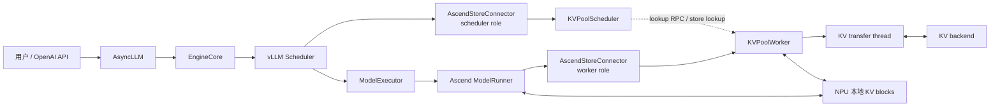
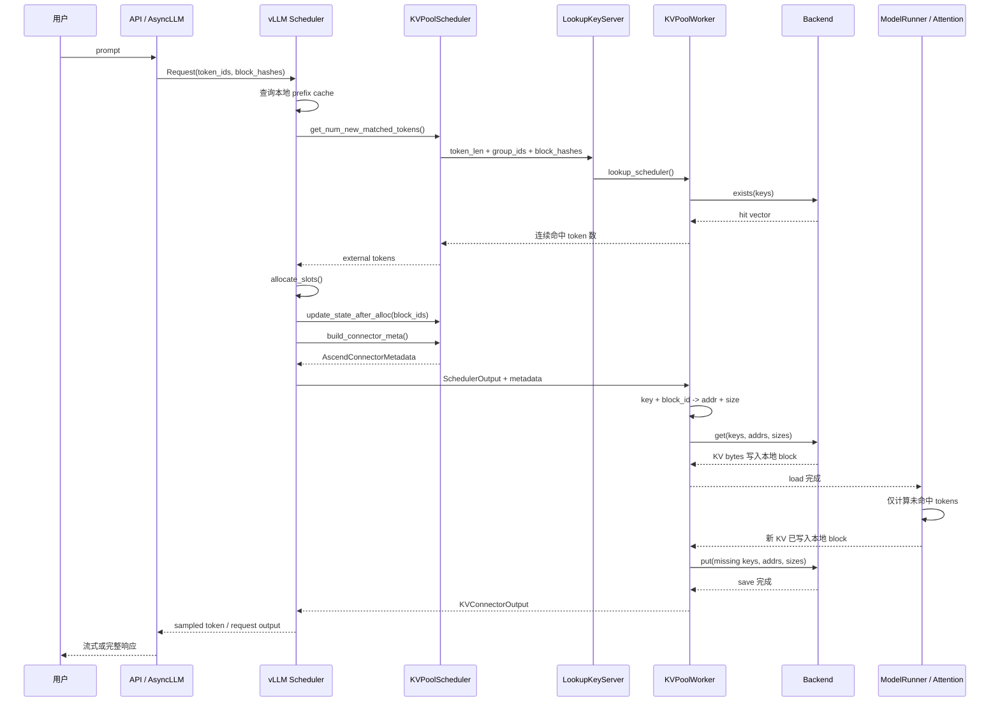

# vLLM-Ascend KV Pool 单请求端到端源码走读

本文不按目录介绍 KV Pool，而是沿着一个真实用户请求追踪它的完整生命周期：

```text
用户发送 prompt
  -> vLLM 接收并创建 Request
  -> scheduler 查询本地 KV cache 和外部 KV Pool
  -> 为请求分配本地 KV block
  -> scheduler 构造 KV connector 元数据
  -> worker 将外部 KV 读入本地 block
  -> 模型只计算未命中的 token
  -> worker 将新产生的 KV 写入外部存储
  -> 完成状态返回 scheduler
  -> scheduler 释放 block 并返回生成结果
```

建议先顺序读完第 1 到第 10 章，再按第 11 章的路线逐个打开源码。本文的相对路径分别以 `vllm/` 和 `vllm-ascend/` 仓库根目录为基准。

## 1. 先建立正确的运行模型

KV Pool 不是模型里的 pooling。它是位于设备本地 KV cache 之外、可跨请求或跨实例复用的 KV 存储层。

一次请求会接触两类缓存：

| 缓存 | 所在位置 | 管理者 | 请求执行时的作用 |
|---|---|---|---|
| 本地 KV cache | NPU HBM 中的 block | vLLM `KVCacheManager` | attention 直接读写 |
| 外部 KV Pool | Mooncake、Memcache、Yuanrong 等后端 | `AscendStoreConnector` | 在 forward 前后与本地 block 交换 KV |

必须始终区分两条流：

1. **控制流**：`request_id`、token 数、block hash、本地 block id、load/save 范围和完成状态。
2. **数据流**：真正的 K/V tensor 字节，从外部存储复制到 NPU 地址，或从 NPU 地址复制到外部存储。

Scheduler 只处理控制流，不搬运 KV tensor。Worker 同时拿到控制信息和本地 KV cache 地址，因此真正的数据存取只能发生在 worker。

## 2. 全局参与者和边界



主要职责：

| 组件 | 关键职责 |
|---|---|
| `Scheduler` | 计算本地/外部命中，分配本地 block，决定本轮计算量 |
| `KVPoolScheduler` | 查询外部命中，维护请求 tracker，构造 `ReqMeta` |
| `AscendStoreConnector` | 将 vLLM 标准 connector 生命周期转发给 scheduler/worker 实现 |
| `KVPoolWorker` | 注册 KV tensor，生成 key/address/size，提交 load/save |
| `KVTransferThread` | 后台执行 `get`、`put` 或 GVA `batch_copy` |
| `Backend` | 屏蔽 Mooncake、Memcache、Yuanrong 的接口差异 |

## 3. 服务启动时先准备了什么

理解单请求前，先确认请求依赖的基础设施何时建立。

### 3.1 Connector 注册和实例化

```text
vllm-ascend 插件加载
  -> vllm_ascend.register_connector()
  -> KVConnectorFactory.register_connector("AscendStoreConnector", ...)

Scheduler 初始化
  -> KVConnectorFactory.create_connector(role=SCHEDULER)
  -> AscendStoreConnector.connector_scheduler = KVPoolScheduler(...)

Worker 初始化
  -> ensure_kv_transfer_initialized(...)
  -> KVConnectorFactory.create_connector(role=WORKER)
  -> AscendStoreConnector.connector_worker = KVPoolWorker(...)
```

入口文件：

- `vllm_ascend/distributed/kv_transfer/__init__.py`
- `vllm_ascend/distributed/kv_transfer/kv_pool/ascend_store/ascend_store_connector.py`
- `vllm_ascend/distributed/kv_transfer/kv_pool/ascend_store/pool_scheduler.py`
- `vllm_ascend/distributed/kv_transfer/kv_pool/ascend_store/pool_worker.py`

### 3.2 注册本地 KV cache 内存

模型 KV cache 分配完成后：

```text
ModelRunner / KVConnector agent
  -> AscendStoreConnector.register_kv_caches(kv_caches)
  -> KVPoolWorker.register_kv_caches(kv_caches)
```

`KVPoolWorker.register_kv_caches()` 完成四件关键工作：

1. 保存 `layer_name -> KV tensor` 映射。
2. 从 tensor 取得 `data_ptr()`、每个 block 的字节长度和 stride。
3. 调用 `ChunkedTokenDatabase.set_group_buffers()` 保存各 cache group 的基址布局。
4. 初始化 backend、注册内存区域并启动收发线程。

之后才能把一个逻辑 block id 转成真实地址：

```text
block_id
  -> addr = group_base_addr + block_id * block_stride
  -> size = block_len / block_size * token_count
```

对应源码：

- `pool_worker.py::register_kv_caches()`
- `config_data.py::ChunkedTokenDatabase.set_group_buffers()`
- `config_data.py::ChunkedTokenDatabase.prepare_value()`
- `kv_transfer.py::KVTransferThread.run()`

### 3.3 普通模式的 lookup RPC

普通非 layerwise 模式下，scheduler 不直接持有 worker backend。rank 0 worker 创建 `LookupKeyServer`，scheduler 侧延迟创建 `LookupKeyClient`。

```text
LookupKeyClient
  -- ZMQ REQ: token_len + group_ids + block_hashes -->
LookupKeyServer
  -> KVPoolWorker.lookup_scheduler()
  -> backend.exists(keys)
  <-- 连续命中的 token 数 --
```

这条 RPC 只查询 key 是否存在，不传输 KV 数据。

## 4. 用户请求如何进入 Scheduler

以 OpenAI Chat Completion 为例，上游路径可概括为：

```text
POST /v1/chat/completions
  -> entrypoints/openai/chat_completion/api_router.py
     create_chat_completion()
  -> OpenAIServingChat.create_chat_completion()
  -> AsyncLLM.generate()
  -> AsyncLLM.add_request()
  -> EngineCoreClient.add_request_async()
  -> EngineCore.add_request()
  -> Scheduler.add_request()
```

在这条路径中，消息被模板化并 tokenize，最终形成 `Request`。对 KV Pool 最重要的字段是：

| 字段 | 用途 |
|---|---|
| `request_id` | 串联 scheduler、worker 和后台线程状态 |
| `prompt_token_ids` / `all_token_ids` | 确定请求长度和保存事件信息 |
| `block_hashes` | 生成外部 KV Pool key |
| `num_computed_tokens` | 表示本地已经可复用的 token 数 |

EngineCore 的每轮执行主循环是：

```text
EngineCore.step()
  -> scheduler.schedule()
  -> model_executor.execute_model(scheduler_output)
  -> scheduler.update_from_output(scheduler_output, model_output)
```

KV Pool 的绝大多数调用就嵌在这三个阶段中。

## 5. 案例 A：首次请求未命中，KV 如何产生并写入

先追踪一个从未出现过的 prompt。设 prompt 有 1024 tokens，KV Pool 中没有对应 key。

### 5.1 Scheduler 先查本地，再查外部

`Scheduler.schedule()` 先通过 `KVCacheManager` 查本地 prefix cache，然后调用：

```text
Scheduler.schedule()
  -> connector.get_num_new_matched_tokens(request, local_hit_tokens)
  -> AscendStoreConnector.get_num_new_matched_tokens()
  -> KVPoolScheduler.get_num_new_matched_tokens()
```

普通模式继续走：

```text
KVPoolScheduler
  -> LookupKeyClient.lookup(token_len, block_hashes, group_ids)
  -> LookupKeyServer
  -> KVPoolWorker.lookup_scheduler()
  -> ChunkedTokenDatabase.process_tokens()
  -> PoolKey.to_string()
  -> backend.exists(keys)
```

首次请求的 `exists` 返回未命中，所以：

```text
local_hit_tokens = 0
external_hit_tokens = 0
num_computed_tokens = 0
num_new_tokens = request.num_tokens
```

### 5.2 Key 是如何生成的

`ChunkedTokenDatabase.process_tokens()` 按 cache group 的 block/chunk 粒度遍历 token 区间。每个区间使用对应 `block_hash` 生成 `PoolKey`：

```text
model_name
@pcp{pcp_rank}@dcp{dcp_rank}
@head_or_tp_rank:{rank}
@pp_rank:{pp_rank}
@group:{kv_cache_group_id}
@cache_role:{kv|state}
@cache_family:{default|c1|c4|...}
@{chunk_hash}
```

Key 表示“这段 token 前缀在特定模型、并行 rank、cache group 和 cache 布局下的 KV”。因此只有 key 完全一致的数据才能复用。

Layerwise 模式使用 `LayerPoolKey`，还会加入：

```text
@layer_id:{layer_id}
```

### 5.3 Scheduler 分配本地 block

即使要从外部加载 KV，也必须先在本地 HBM 中有落点。未命中请求则为完整 prefill 分配 block：

```text
Scheduler.schedule()
  -> KVCacheManager.allocate_slots(...)
  -> connector.update_state_after_alloc(
         request,
         kv_cache_manager.get_blocks(request_id),
         num_external_computed_tokens,
     )
```

`KVPoolScheduler.update_state_after_alloc()` 将请求和本地 block id 放进 `_unfinished_requests`。首次未命中没有 `LoadSpec`，所以这里只记录状态，不安排 load。

### 5.4 Scheduler 构造发给 worker 的元数据

调度结束前：

```text
Scheduler.schedule()
  -> connector.build_connector_meta(scheduler_output)
  -> KVPoolScheduler.build_connector_meta()
  -> _process_new_request()
  -> RequestTracker
  -> ReqMeta.from_request_tracker()
  -> AscendConnectorMetadata.requests.append(req_meta)
  -> scheduler_output.kv_connector_metadata = metadata
```

此时最重要的数据变化是：

```text
Request
  request_id
  prompt_token_ids
  block_hashes

        + 本地 block 分配结果

RequestTracker
  req_id
  token_len
  allocated_block_ids_by_group
  num_saved_tokens

        + 本轮 load/save 决策

ReqMeta
  req_id
  block_hashes
  block_ids_by_group
  load_spec = None
  can_save = True
  save_start_token
  save_end_token
```

`RequestTracker` 是 scheduler 侧跨调度轮次的长期状态；`ReqMeta` 是本轮发给 worker 的快照。

### 5.5 Worker forward 前不加载

`scheduler_output` 被 `ModelExecutor` 送到 worker。Ascend ModelRunner 使用上游 `KVConnectorModelRunnerMixin` 包住 forward：

```text
ModelRunner.execute_model()
  -> maybe_get_kv_connector_output()
  -> _get_kv_connector_output()
  -> connector.bind_connector_metadata(metadata)
  -> connector.start_load_kv(forward_context)
  -> KVPoolWorker.start_load_kv(metadata)
```

由于 `ReqMeta.load_spec is None`，worker 跳过 `get`。模型正常执行所有 prompt token，attention kernel 将每层 K/V 写入之前分配的本地 KV blocks。

这里要抓住一个边界：KV Pool 不生成 KV。KV 始终由模型 forward 产生，KV Pool 只负责复制和复用。

### 5.6 Forward 后将新 KV 写入 Pool

退出 connector context 时：

```text
KVConnectorModelRunnerMixin._get_kv_connector_output()
  -> connector.wait_for_save()
  -> AscendStoreConnector.wait_for_save()
  -> KVPoolWorker.wait_for_save(metadata)
  -> kv_send_thread.add_request(req_meta)
  -> KVCacheStoreSendingThread._handle_request(req_meta)
```

发送线程逐个 cache group 执行：

```text
ReqMeta.block_hashes + token range
  -> process_tokens_with_block_ids()
  -> keys + start/end + block ids

block ids + 已注册的 KV tensor 基址
  -> prepare_value()
  -> addrs + sizes

keys
  -> backend.exists(keys)
  -> 过滤已经存在的 key

missing keys + addrs + sizes
  -> backend.put(keys, addrs, sizes)
  -> 外部 KV Pool
```

这里的 `addr` 指向模型刚刚写完的 NPU KV block。`put` 的本质是按照 `size` 从这些地址读取字节，并以对应 key 保存到外部后端。

`wait_for_save()` 最后调用 `request_queue.join()`，保证本轮 store 对后续相同 prompt 的 lookup 可见，避免后一个请求在 put 完成前查到 miss。

### 5.7 保存完成状态如何返回

后台发送线程完成后记录 `finished_requests`。connector context 随后收集：

```text
KVPoolWorker.get_finished()
  -> done_sending
KVPoolWorker.build_connector_worker_meta()
  -> 可选 completed_events
  -> KVConnectorOutput
  -> ModelRunnerOutput.kv_connector_output
  -> Scheduler.update_from_output()
  -> connector.update_connector_output()
```

如果请求结束时发送仍未完成，`request_finished()` 可以要求 scheduler 延迟释放本地 blocks。等 `finished_sending` 返回后，再解除延迟释放。这样后端复制期间不会复用或覆盖源 block。

## 6. 案例 B：相同前缀再次请求，KV 如何命中并读回

现在发送一个具有相同 1024-token 前缀的新请求。假设本地 prefix cache 未命中，但外部 KV Pool 已保存前 1024 tokens。

### 6.1 Lookup 只接受连续前缀

`KVPoolWorker.lookup_scheduler()` 生成与保存时相同的 keys，然后调用 `backend.exists(keys)`。

命中计算不是简单统计 `True` 的数量，而是找可用的连续前缀边界。若 keys 结果为：

```text
[True, True, True, False, True]
```

有效命中只能到第一个缺口之前，不能跳过中间 block 使用后面的 KV。Hybrid KV cache 时还要跨有效 cache groups 取安全的公共命中长度。

若外部命中覆盖了整个请求，`get_num_new_matched_tokens()` 会减去 1 个 token：

```text
if num_external_hit_tokens == request.num_tokens:
    num_external_hit_tokens -= 1
```

这是为了保留至少一个 token 进入模型计算，从而继续生成输出。

### 6.2 Scheduler 合并本地与外部命中

上游 scheduler 使用：

```text
total_computed = local_hit_tokens + external_new_hit_tokens
num_new_tokens = request.num_tokens - total_computed
```

`KVPoolScheduler` 内部保存：

```text
LoadSpec(
    vllm_cached_tokens=local_hit_tokens,
    kvpool_cached_tokens=external_total_hit_tokens,
    can_load=False,
)
```

它返回给上游的是还需要从外部加载的增量：

```text
need_to_allocate = kvpool_cached_tokens - vllm_cached_tokens
```

例如本地命中 256、KV Pool 命中 1024，则只需为额外 768 tokens 安排外部加载，不应覆盖本地已经有效的前 256 tokens。

### 6.3 先分配目标 block，再允许加载

`KVCacheManager.allocate_slots()` 为外部命中和剩余计算分配本地 blocks。随后：

```text
KVPoolScheduler.update_state_after_alloc()
  -> 取得各 cache group 的 local_block_ids
  -> 保存到 _unfinished_requests
  -> LoadSpec.can_load = True
```

顺序不能颠倒。Lookup 只证明外部数据存在；只有本地 block 分配成功后，worker 才知道 KV 应该写到哪里。

### 6.4 LoadSpec 和 block 映射随 SchedulerOutput 下发

`build_connector_meta()` 创建本轮 `ReqMeta`：

```text
ReqMeta
  req_id
  block_hashes
  block_ids_by_group      # 目标本地 block
  load_spec
    vllm_cached_tokens    # 无需从 Pool 覆盖的前缀
    kvpool_cached_tokens  # Pool 可提供到哪里
    can_load = True
  can_save
  save_start_token / save_end_token
```

注意，元数据中没有 KV tensor 内容。它只携带“用什么 key，加载到哪些 block”的描述。

### 6.5 Worker 将 key 解析为目标 NPU 地址

同步普通模式的 load 主链：

```text
KVPoolWorker.start_load_kv(metadata)
  -> 遍历 metadata.requests
  -> 根据 LoadSpec 计算 token_len 和 mask_num
  -> ChunkedTokenDatabase.process_tokens_with_block_ids()
  -> ChunkedTokenDatabase.prepare_value()
  -> backend.get(key_list, addr_list, size_list)
```

其中：

```text
mask_num = floor(vllm_cached_tokens / group_block_size) * group_block_size
```

`mask_num` 之前的 key 被跳过，因为这些 KV 已经存在于本地 HBM。

每个待读取 chunk 形成三元组：

```text
key  = PoolKey(..., chunk_hash).to_string()
addr = local_kv_base + local_block_id * block_stride
size = bytes_per_block / tokens_per_block * tokens_in_chunk
```

`backend.get(keys, addrs, sizes)` 的数据方向是：

```text
外部 KV Pool[key] -> worker NPU addr -> 本地 KV block
```

Load 完成后，attention 看到的只是已经填充好的普通本地 KV blocks，并不需要理解外部存储。

### 6.6 模型只计算未命中的 token

Scheduler 已将外部命中的 token 计入 `num_computed_tokens`，因此 ModelRunner 只准备剩余 token 的 input 和 slot mapping。

模型 forward 时：

```text
已加载的前缀 KV blocks
  + 本轮未命中的 input tokens
  -> attention
  -> 新 token 的 K/V 继续写入后续本地 blocks
  -> logits / sampled token
```

这就是 KV Pool 降低 TTFT 的核心：跳过命中前缀的重复 prefill 计算，但仍使用这些前缀的 K/V 参与 attention。

### 6.7 新计算部分继续写回 Pool

forward 后仍走第 5.6 节的 save 路径。`RequestTracker.num_saved_tokens` 和 `ReqMeta.save_start_token/save_end_token` 用于避免反复保存已经处理过的范围。

`ReqMeta.from_request_tracker()` 按 `cache_transfer_granularity` 计算可保存的完整 chunk 边界，并更新 tracker。发送线程又会先 `exists`，所以已经存在的 keys 不会重复 put。

至此，新请求既消费了旧 KV，也可以扩展 KV Pool 中的可复用前缀。

## 7. 普通同步模式完整时序图



## 8. 异步加载分支怎么变化

当 `load_async=true` 且不是 layerwise 模式时，`get_num_new_matched_tokens()` 返回 `(external_tokens, True)`。

第一次调度只做加载，不做模型计算：

```text
Scheduler.schedule()
  -> num_new_tokens = 0
  -> allocate_slots(... delay_cache_blocks=True)
  -> request.status = WAITING_FOR_REMOTE_KVS
  -> build_connector_meta()
```

Worker 侧变化为：

```text
KVPoolWorker.start_load_kv()
  -> kv_recv_thread.add_request(req_meta)
  -> KVCacheStoreRecvingThread._handle_request()
  -> backend.get(keys, addrs, sizes)
  -> finished_requests.add(req_id)
```

本轮即使没有 forward，`kv_connector_no_forward()` 也会驱动 connector，并通过 `KVConnectorOutput.finished_recving` 把完成状态返回 scheduler。

```text
Scheduler.update_from_output()
  -> finished_recving_kv_req_ids.add(req_id)
下一轮 Scheduler.schedule()
  -> _try_promote_blocked_waiting_request()
  -> 请求离开 WAITING_FOR_REMOTE_KVS
  -> 使用已加载 KV 执行剩余 token
```

异步模式因此将一次逻辑请求拆成至少两个 scheduler step：第一步搬 KV，后续一步才 forward。

## 9. Layerwise 模式怎么变化

普通模式以一个 chunk 为单位一次搬运所有层的 KV。Layerwise 模式把 key 和传输任务增加 `layer_id` 维度，使第 N 层的 load/save 能与其他层计算重叠。

### 9.1 元数据准备

```text
KVPoolWorker.start_load_kv()
  -> process_layer_data(metadata.requests)
  -> 为每层生成 LayerTransferTask / LayerLoadTask
```

### 9.2 每层 attention 前加载

attention 实现中的 connector hook 调用：

```text
进入 layer N attention
  -> connector.wait_for_layer_load(layer_name)
  -> KVPoolWorker.wait_for_layer_load()
  -> 提交可执行的 layer load
  -> 等待 layer_load_finished_events[N]
  -> layer N attention 读取已加载 KV
```

GVA layerwise 路径由 `KVCacheStoreLayerRecvingThread` 使用：

```text
LayerPoolKey / GVA + local addrs + sizes
  -> backend.store.batch_copy(direction=1)
  -> 当前层本地 KV 地址
```

### 9.3 每层计算后保存

```text
layer N attention 完成
  -> connector.save_kv_layer(...)
  -> KVPoolWorker.save_kv_layer()
  -> 记录 NPU event
  -> KVCacheStoreLayerSendingThread
  -> event.synchronize()
  -> backend.store.batch_copy(direction=0)
```

`direction=1` 是外部/GVA 到本地地址，`direction=0` 是本地地址到外部/GVA。

重点阅读：

- `vllm_ascend/attention/utils.py`
- `vllm_ascend/attention/attention_v1.py` 或当前 backend 的 attention 实现
- `pool_worker.py::process_layer_data()`
- `pool_worker.py::wait_for_layer_load()`
- `pool_worker.py::save_kv_layer()`
- `kv_transfer.py::KVCacheStoreLayerRecvingThread`
- `kv_transfer.py::KVCacheStoreLayerSendingThread`

## 10. 失败、抢占和请求结束

### 10.1 Load 失败

普通 `get` 返回码中非 0 的项会被 `record_failed_blocks()` 转成本地 `invalid_block_ids`：

```text
backend.get() failure
  -> KVPoolWorker._invalid_block_ids
  -> connector.get_block_ids_with_load_errors()
  -> KVConnectorOutput.invalid_block_ids
  -> Scheduler.update_from_output()
```

上游 scheduler 根据 `kv_load_failure_policy` 决定失败请求终止还是驱逐无效 block 后 recompute。读这部分时要关注单 group 与 hybrid group 的差异。

### 10.2 Preemption

Scheduler 将 `preempted_req_ids` 放入 `AscendConnectorMetadata`。Worker 的发送和接收线程丢弃这些请求的完成记录，scheduler 侧也清理 tracker、loading 和 delayed-free 状态。重新调度时通过 `_process_preempted_cached_request()` 建立新的 block 映射。

### 10.3 请求结束与 block 生命周期

```text
请求生成完成
  -> Scheduler._connector_finished()
  -> connector.request_finished() / request_finished_all_groups()
  -> 判断是否 delay_free_blocks
```

普通异步 save 仍在读取源 block 时必须延迟释放；layerwise 已在各层同步完成，通常不再延迟。Worker 后续返回 `finished_sending` 后，scheduler 才安全释放对应 block。

## 11. 按调用链走读源码

不要先通读整个目录。每一步只回答给出的问题，再进入下一步。

### 第 1 步：请求如何进入调度循环

阅读：

1. `vllm/entrypoints/openai/chat_completion/api_router.py`
2. `vllm/entrypoints/openai/chat_completion/serving.py`
3. `vllm/v1/engine/async_llm.py::generate()`、`add_request()`
4. `vllm/v1/engine/core.py::add_request()`、`step()`
5. `vllm/v1/core/sched/scheduler.py::add_request()`、`schedule()`

回答：`Request.block_hashes` 在进入 KV Pool 前何时生成？一次 engine step 的三个阶段是什么？

### 第 2 步：外部命中如何影响计算量

阅读：

1. `vllm/v1/core/sched/scheduler.py` 中 `get_num_new_matched_tokens()` 调用点
2. `ascend_store_connector.py::get_num_new_matched_tokens()`
3. `pool_scheduler.py::get_num_new_matched_tokens()`

回答：本地命中和外部命中如何相加？为什么全命中要减 1？同步和异步返回值有什么不同？

### 第 3 步：从 block hash 追到 backend.exists

阅读：

1. `pool_scheduler.py::LookupKeyClient.lookup()`
2. `ascend_store_connector.py::LookupKeyServer`
3. `pool_worker.py::lookup_scheduler()`
4. `config_data.py::ChunkedTokenDatabase.process_tokens()`
5. `config_data.py::PoolKey.to_string()`
6. `backend/backend.py::Backend.exists()`

回答：一个 key 包含哪些隔离维度？为什么 lookup 必须返回连续前缀而不是命中总数？

### 第 4 步：从命中 token 追到本地 block

阅读：

1. `scheduler.py::KVCacheManager.allocate_slots()` 调用点
2. `ascend_store_connector.py::update_state_after_alloc()`
3. `pool_scheduler.py::update_state_after_alloc()`
4. `config_data.py::LoadSpec`

回答：为什么 lookup 后不能立即 load？`vllm_cached_tokens` 和 `kvpool_cached_tokens` 的差值代表什么？

### 第 5 步：从 Request 追到 ReqMeta

阅读：

1. `pool_scheduler.py::build_connector_meta()`
2. `_process_new_request()`
3. `_process_running_cached_request()`
4. `_process_async_load_request()`
5. `config_data.py::RequestTracker`
6. `config_data.py::ReqMeta.from_request_tracker()`

回答：哪些状态跨 step 保存在 scheduler，哪些字段只属于本轮 worker 指令？保存范围如何避免重复？

### 第 6 步：从 SchedulerOutput 追到 worker load

阅读：

1. `vllm/v1/engine/core.py::step()`
2. `vllm_ascend/worker/model_runner_v1.py::execute_model()`
3. `vllm/v1/worker/kv_connector_model_runner_mixin.py::_get_kv_connector_output()`
4. `ascend_store_connector.py::start_load_kv()`
5. `pool_worker.py::start_load_kv()`

回答：connector metadata 在哪里 bind？同步 `get` 位于 forward 之前还是之后？无 forward 的 step 如何驱动异步传输？

### 第 7 步：从 block id 追到 KV 字节

阅读：

1. `pool_worker.py::register_kv_caches()`
2. `config_data.py::set_group_buffers()`
3. `config_data.py::prepare_value()`
4. `backend/backend.py::get()`
5. 当前使用的具体 backend 实现

拿一个 block 手算：

```text
block_id -> base_addr + block_id * stride -> addr
token range -> size
block_hash -> PoolKey -> key string
backend.get(key, addr, size)
```

回答：key、block id 和物理地址各自解决什么问题？

### 第 8 步：从模型 forward 追到 backend.put

阅读：

1. `KVConnectorModelRunnerMixin._get_kv_connector_output()` 的 `finally`
2. `ascend_store_connector.py::wait_for_save()`
3. `pool_worker.py::wait_for_save()`
4. `kv_transfer.py::KVTransferThread.run()`
5. `kv_transfer.py::KVCacheStoreSendingThread._handle_request()`
6. `backend/backend.py::put()`

回答：为什么 put 前还要 exists？NPU event 和 `request_queue.join()` 分别保证什么？

### 第 9 步：完成状态如何回到 scheduler

阅读：

1. `pool_worker.py::get_finished()`
2. `pool_worker.py::build_connector_worker_meta()`
3. `KVConnectorModelRunnerMixin._get_kv_connector_output()` 输出构造
4. `scheduler.py::update_from_output()`
5. `pool_scheduler.py::update_connector_output()`
6. `pool_scheduler.py::request_finished()`

回答：什么时候可以释放本地 block？`finished_sending`、`finished_recving` 和 worker meta 各自携带什么？

### 第 10 步：最后再读分支

按需要选择：

- 异步 load：`KVCacheStoreRecvingThread`、`WAITING_FOR_REMOTE_KVS`
- Layerwise：`process_layer_data()`、两个 Layer transfer thread、attention hooks
- Hybrid KV cache：`block_ids_by_group`、`kv_cache_group_ids`、cache family
- Mamba：event id、touch/free block 和 worker completed events
- MultiConnector：`ascend_multi_connector.py`
- 失败恢复：`invalid_block_ids` 和 scheduler recompute 路径

## 12. 走读时维护一张请求状态表

建议用一个具体 `request_id`，每经过一个断点就填写一行：

| 阶段 | local hit | pool hit | scheduled tokens | block ids | load | save | 状态 |
|---|---:|---:|---:|---|---|---|---|
| 首次进入 scheduler |  |  |  |  |  |  | WAITING |
| lookup 后 |  |  |  |  |  |  | WAITING |
| allocate 后 |  |  |  |  |  |  | WAITING/RUNNING |
| metadata 构造后 |  |  |  |  |  |  |  |
| worker load 后 |  |  |  |  | done |  |  |
| forward 后 |  |  |  |  |  | pending |  |
| save 后 |  |  |  |  |  | done |  |
| update_from_output 后 |  |  |  |  |  |  |  |

同时记录一个 chunk 的四元组：

```text
(token range, block hash/key, local block id/address, transfer size)
```

只要能把这个四元组从 lookup 一直追到 get/put，KV Pool 的数据流就真正串起来了。

## 13. 推荐断点和日志点

普通同步模式最小断点集合：

```text
KVPoolScheduler.get_num_new_matched_tokens
KVPoolWorker.lookup_scheduler
KVPoolScheduler.update_state_after_alloc
KVPoolScheduler.build_connector_meta
ReqMeta.from_request_tracker
KVPoolWorker.start_load_kv
ChunkedTokenDatabase.prepare_value
Backend.get
KVPoolWorker.wait_for_save
KVCacheStoreSendingThread._handle_request
Backend.put
KVPoolWorker.get_finished
Scheduler.update_from_output
```

每个断点优先观察：

```text
req_id
token_len / num_computed_tokens
block_hashes[:3]
block_ids_by_group
LoadSpec
save_start_token / save_end_token
keys[:3]
addrs[:3]
sizes[:3]
backend return codes
finished_sending / finished_recving
```

## 14. 最终应能复述的机制

完成走读后，应能不看源码说明下面这段话：

> 用户请求进入 scheduler 后，vLLM 先计算本地 prefix cache 命中，再由 `KVPoolScheduler` 把 block hashes 转成外部 keys 并查询连续命中前缀。Scheduler 将外部命中计入已计算 token，但仍先为它们分配本地 KV blocks。随后 `ReqMeta` 把 block hashes、目标 block ids 和 load/save 范围下发给 worker。Worker 根据启动时注册的 KV tensor 基址，把 block id 转成 NPU 地址，通过 backend `get` 将外部 KV 写入这些地址。模型只计算剩余 token，并把新 KV 写入后续本地 blocks。Forward 结束后，发送线程使用相同 key 规则和本地地址调用 backend `put`。传输完成状态再通过 `KVConnectorOutput` 回到 scheduler，决定请求继续调度以及本地 block 何时释放。

如果这段话中的每个名词都能对应到一个类、一个方法和一组具体字段，就已经掌握了 KV Pool 的主运行机制。
