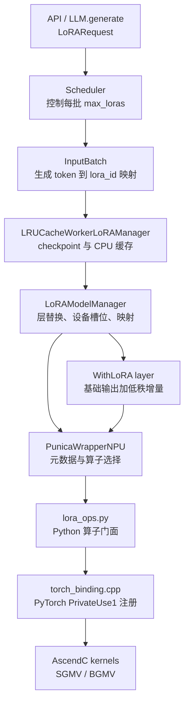

# vLLM-Ascend LoRA 机制与源码走读指南

本文以“一条携带 LoRA 的请求如何在 NPU 上完成推理”为主线，介绍 LoRA 的数学原理、vLLM 的运行时设计、vLLM-Ascend 的平台适配、完整调用链，以及可以实际照着断点和检查张量的源码走读方法。

先记住整条主链：

```text
启动参数 --enable-lora / --lora-modules
  -> 构造 LoRAConfig 和 LoRARequest
  -> 加载基础模型
  -> LoRAModelManager 将目标层替换为 WithLoRA 包装层
  -> 预分配 max_loras 个设备权重槽位
  -> 请求进入引擎并携带 LoRARequest
  -> Scheduler 保证本批 LoRA 数量不超过 max_loras
  -> InputBatch 生成 request/token -> lora_id 映射
  -> WorkerLoRAManager 按需从 checkpoint 加载适配器到 CPU 缓存
  -> LoRAModelManager 把适配器复制进 NPU 槽位并更新映射元数据
  -> 基础层计算 y_base = xW
  -> PunicaWrapperNPU 计算 y_lora = (xA^T)B^T
  -> y = y_base + y_lora
  -> torch.ops._C_ascend.sgmv_* / bgmv_* 执行 NPU 算子
```

文中的相对路径分别以 `vllm/` 和 `vllm-ascend/` 仓库根目录为基准。当前代码以 vLLM V1 Engine 为主。

## 1. LoRA 原理

### 1.1 为什么是低秩增量

设基础线性层权重为：

```text
W ∈ R^(d_out × d_in)
x ∈ R^(T × d_in)
```

全量微调直接更新 `W`。LoRA 冻结 `W`，只训练一个低秩增量：

```text
ΔW = s · B · A
A ∈ R^(r × d_in)
B ∈ R^(d_out × r)
r << min(d_in, d_out)
```

因此前向计算是：

```text
y = xW^T + s · xA^T B^T
```

普通 LoRA 的缩放系数 `s = alpha / r`；rsLoRA 使用 `s = alpha / sqrt(r)`。vLLM 加载适配器后会在 `LoRALayerWeights.optimize()` 中把 `s` 预先乘进 `B`，所以运行时传入算子的缩放通常已经是 `1.0`。

例如 `d_in=d_out=4096, r=16` 时：

```text
全量增量参数：4096 × 4096 = 16,777,216
LoRA 参数：    16 × 4096 + 4096 × 16 = 131,072
```

LoRA 参数量约为全量矩阵的 `0.78%`。推理时无需为每个任务复制整套基础模型，只需共享 `W`，为每个适配器保存较小的 `A/B`。

### 1.2 vLLM 为什么不直接合并权重

离线单 LoRA 可以预先计算 `W + ΔW`，但在线 Multi-LoRA 场景不能简单合并：同一个 batch 中，不同 token 可能属于不同请求，而不同请求可能使用不同适配器或不使用 LoRA。

vLLM 因此采用“基础模型只算一次通用路径，LoRA 增量按 token 动态路由”的方式：

```text
token 0, 1, 2 -> adapter A
token 3       -> no LoRA
token 4, 5    -> adapter B
```

运行时用 `token_lora_indices` 指明每个 token 应读取设备权重栈中的哪个槽位，专用 grouped GEMV/GEMM 算子据此选择 `A/B`。

### 1.3 shrink 与 expand

LoRA 的两次矩阵乘在代码中被命名为：

```text
shrink: z = x @ A^T        # d_in -> r
expand: y += z @ B^T       # r -> d_out
```

`shrink` 把隐藏维压缩到 rank，`expand` 再扩回输出维。对于 `qkv_proj`、`gate_up_proj` 等 packed 层，会有多组 A/B，expand 时写入输出张量的不同 slice。

## 2. 运行时分层



| 层次 | 主要对象 | 回答的问题 |
|---|---|---|
| 配置与请求 | `LoRAConfig`、`LoRARequest` | 是否启用、适配器是谁、允许多大 rank、单批最多几个 LoRA |
| 调度 | `Scheduler`、`InputBatch` | 哪些请求能进入本批，每个 token 使用哪个 LoRA |
| 权重管理 | `WorkerLoRAManager`、`LoRAModelManager` | 权重从哪里加载，放在哪个 CPU/NPU 槽位 |
| 层包装 | `BaseLayerWithLoRA` 及子类 | 哪些基础层可替换，A/B 如何按 TP 或 packed 布局存放 |
| 算子抽象 | `PunicaWrapperBase`、`PunicaWrapperNPU` | 如何把映射变为算子元数据，调用 shrink 还是 expand |
| NPU 实现 | `_C_ascend`、AscendC kernel | 最终如何执行分组矩阵乘 |

理解代码时不要把以下三个编号混在一起：

| 名称 | 含义 |
|---|---|
| `lora_int_id` | 适配器在请求和引擎中的稳定逻辑 ID，要求大于 0 |
| slot index | 适配器当前占用的 NPU 权重槽位，范围通常为 `[0, max_loras)` |
| token LoRA index | 算子逐 token 读取的槽位索引；无 LoRA 会转换为哨兵值 |

## 3. 核心数据结构与张量布局

### 3.1 LoRAConfig

入口：`vllm/config/lora.py::LoRAConfig`。

常用字段：

| 字段 | 作用 |
|---|---|
| `max_lora_rank` | 设备缓冲区按此最大 rank 预分配；实际适配器 rank 不能超过它 |
| `max_loras` | 同一个 batch 最多同时激活的 LoRA 数，也是 NPU 槽位数 |
| `max_cpu_loras` | CPU 缓存容量，必须不小于 `max_loras` |
| `lora_dtype` | LoRA A/B 的运行时 dtype，`auto` 时跟随基础模型 |
| `fully_sharded_loras` | TP 下是否同时切分 LoRA A、B 两段计算 |
| `target_modules` | 部署时进一步限制允许包装的模块后缀 |
| `enable_tower_connector_lora` | 是否为多模态 tower/connector 启用 LoRA |

`max_loras` 是单批并发种类上限，不是服务整个生命周期只能加载几个适配器；后者主要由 `max_cpu_loras` 和 LRU 策略决定。

### 3.2 LoRARequest

入口：`vllm/lora/request.py::LoRARequest`。

最关键的字段是：

```text
lora_name    用户可见名称，也是 OpenAI API 中可作为 model 使用的名称
lora_int_id  引擎内部正整数 ID
lora_path    adapter_config.json 与 adapter_model.* 所在目录
```

离线调用通常直接构造 `LoRARequest`；在线服务可通过 `--lora-modules` 静态注册，也可通过动态加载接口创建。

### 3.3 LoRALayerWeights 与设备权重栈

checkpoint 中单层通常是：

```text
lora_A.weight: [r, d_in]
lora_B.weight: [d_out, r]
```

`BaseLinearLayerWithLoRA.create_lora_weights()` 为多 LoRA 预分配：

```text
lora_a_stacked: [max_loras, 1, max_rank, input_size]
lora_b_stacked: [max_loras, 1, output_size, max_rank]
```

实际 rank 小于 `max_rank` 时，只复制有效区域，其余位置保持为 0。packed 层用 tuple 保存多组权重，并通过 `output_slices` 指定各组 B 写入输出的范围。

## 4. 启动与建模调用链

### 4.1 从参数到 LoRAConfig

```text
EngineArgs
  -> --enable-lora
  -> --max-loras / --max-lora-rank / --max-cpu-loras
  -> EngineArgs.create_engine_config()
  -> LoRAConfig(...)
  -> VllmConfig.lora_config
```

入口：

- `vllm/engine/arg_utils.py`
- `vllm/config/lora.py`

`LoRAConfig.verify_with_model_config()` 会解析 dtype 等与基础模型相关的配置；`PEFTHelper.validate_legal()` 则在加载具体适配器时校验实际 rank、bias、DoRA 等能力。

### 4.2 ModelRunner 创建两级 Manager

```text
ModelRunner.load_model()
  -> LoRAModelRunnerMixin.load_lora_model(model, config, device)
  -> LRUCacheWorkerLoRAManager(...)
  -> WorkerLoRAManager.create_lora_manager()
  -> create_lora_manager(...)
  -> LRUCacheLoRAModelManager(...)
```

两级 Manager 的分工：

- `LRUCacheWorkerLoRAManager` 面向 worker，负责接收 `LoRARequest`、读 checkpoint、维护 CPU 侧缓存。
- `LRUCacheLoRAModelManager` 面向模型，负责替换层、管理 NPU 权重槽位、把具体 LoRA 写入每个包装层。

入口：

- `vllm/v1/worker/lora_model_runner_mixin.py::load_lora_model()`
- `vllm/lora/worker_manager.py::create_lora_manager()`
- `vllm/lora/model_manager.py::create_lora_manager()`

### 4.3 创建 PunicaWrapperNPU

`LoRAModelManager._init_punica_wrapper()` 调用平台选择器：

```text
get_punica_wrapper(...)
  -> current_platform.get_punica_wrapper()
  -> NPUPlatform.get_punica_wrapper()
  -> "vllm_ascend.lora.punica_npu.PunicaWrapperNPU"
  -> PunicaWrapperNPU(...)
```

入口：

- `vllm/lora/model_manager.py::_init_punica_wrapper()`
- `vllm/lora/punica_wrapper/punica_selector.py`
- `vllm_ascend/platform.py::NPUPlatform.get_punica_wrapper()`
- `vllm_ascend/lora/punica_npu.py::PunicaWrapperNPU`

多模态模型可能为 language model、tower、connector 分别建立 wrapper，它们各自维护映射元数据。

### 4.4 将基础层替换为 WithLoRA 层

`LoRAModelManager._create_lora_modules()` 遍历 `model.named_modules()`：

```text
模块名命中 supported_lora_modules / target_modules
  -> replace_submodule(...)
  -> create_lora_weights(max_loras, lora_config)
  -> register_module(module_name, new_module)
  -> new_module.set_mapping(punica_wrapper)
```

常见包装关系：

| 基础层 | LoRA 包装层 |
|---|---|
| `ReplicatedLinear` | `ReplicatedLinearWithLoRA` |
| `ColumnParallelLinear` | `ColumnParallelLinearWithLoRA` |
| `RowParallelLinear` | `RowParallelLinearWithLoRA` |
| `QKVParallelLinear` | `QKVParallelLinearWithLoRA` 或 merged 版本 |
| `VocabParallelEmbedding` | `VocabParallelEmbeddingWithLoRA` |
| logits processor | `LogitsProcessorWithLoRA` |
| `FusedMoE` | 对应 MoE LoRA 包装层 |

Ascend 自己的 `AscendQKVParallelLinear` 不是上游类的精确类型，因此 `vllm_ascend/lora/utils.py` 增加四个 Ascend QKV 包装判定类。`PunicaWrapperNPU.__init__()` 调用 `refresh_all_lora_classes()`，把它们加入 vLLM 的候选包装类集合。

## 5. 适配器 checkpoint 加载与热切换

### 5.1 checkpoint 加载

首次请求某个尚未缓存的适配器时：

```text
WorkerLoRAManager.set_active_adapters()
  -> _apply_adapters(requests)
  -> add_adapter(lora_request)
  -> _load_adapter(lora_request)
     -> PEFTHelper.from_local_dir(adapter_config.json)
     -> validate_legal(lora_config)
     -> LoRAModel.from_local_checkpoint()
        -> adapter_model.safetensors / .bin / .pt
        -> parse_fine_tuned_lora_name()
        -> LoRALayerWeights(A, B, rank, alpha)
  -> LoRAModelManager.add_adapter()
```

`LoRAModel.from_local_checkpoint()` 先在 CPU 上加载，并检查 checkpoint 中的目标模块是否属于模型支持集合。模型可通过 `hf_to_vllm_mapper` 修正 HF 与 vLLM 的模块名差异。

关键入口：

- `vllm/lora/worker_manager.py::_load_adapter()`
- `vllm/lora/peft_helper.py::PEFTHelper`
- `vllm/lora/lora_model.py::from_local_checkpoint()`
- `vllm/lora/utils.py::parse_fine_tuned_lora_name()`
- `vllm/lora/lora_weights.py`

### 5.2 packed 模块与缩放合并

加载后的模块名可能仍是 `q_proj/k_proj/v_proj`，而运行模型中只有融合后的 `qkv_proj`。`LoRAModelManager._create_merged_loras_inplace()` 会按 `packed_modules_mapping` 将多个 `LoRALayerWeights` 组成 `PackedLoRALayerWeights`。

随后：

```text
for lora in lora_model.loras.values():
    lora.optimize()
```

把 `alpha/r` 或 `alpha/sqrt(r)` 乘入 B，运行时便只做两次矩阵乘和一次加法。

### 5.3 CPU 缓存与 NPU 槽位

`max_cpu_loras` 控制注册适配器的 CPU LRU 缓存，`max_loras` 控制活跃设备槽位。激活过程：

```text
LoRAModelManager.activate_adapter(lora_id)
  -> 找到 lora_index_to_id 中第一个空 slot
  -> 对每个已包装 module 获取该适配器的 LoRALayerWeights
  -> module.set_lora(slot, A, B)
  -> 把 A/B 复制到 lora_a_stacked / lora_b_stacked 的对应 slot
```

缺失某层权重时会调用 `module.reset_lora(slot)` 清零，避免槽位复用后残留上一个适配器的数据。

## 6. 单请求到单批调度调用链

### 6.1 请求进入引擎

离线入口示意：

```python
from vllm import LLM, SamplingParams
from vllm.lora.request import LoRARequest

llm = LLM(model="base-model", enable_lora=True, max_loras=2)
request = LoRARequest("task-a", 1, "/path/to/adapter")
outputs = llm.generate(
    ["prompt"],
    SamplingParams(max_tokens=32),
    lora_request=request,
)
```

在线入口中，请求的 `model` 名会在 serving 层解析为已注册的 `LoRARequest`。之后：

```text
Serving / LLM.generate
  -> AsyncLLM.add_request()
  -> LLMEngine.add_request(..., lora_request)
  -> InputProcessor.process_inputs()
  -> Request.lora_request
  -> EngineCore / Scheduler
```

### 6.2 Scheduler 限制本批 LoRA 种类

`vllm/v1/core/sched/scheduler.py` 为当前轮维护 `scheduled_loras`。准备加入 waiting request 时，如果：

```text
len(scheduled_loras) == max_loras
且新请求的 lora_int_id 不在 scheduled_loras 中
```

则跳过该请求，留待后续调度。因此 `max_loras` 过小通常表现为排队或吞吐下降，而不是把错误适配器强行塞进本批。

### 6.3 InputBatch 生成映射

每个请求进入 `InputBatch` 时，会记录：

```text
request_lora_mapping[req_index] = lora_int_id  # 无 LoRA 为 0
lora_id_to_lora_request[lora_int_id] = LoRARequest
```

每轮执行前：

```text
NPUModelRunner.execute_model()
  -> LoRAModelRunnerMixin.set_active_loras(input_batch, ...)
  -> input_batch.make_lora_inputs(...)
  -> prompt_lora_mapping
  -> token_lora_mapping
  -> active_lora_requests
```

`token_lora_mapping` 按每个请求本轮调度的 token 数 repeat，长度等于本轮实际送入模型的 token 总数；`prompt_lora_mapping` 面向采样/logits 路径。

Ascend 的 `NPUInputBatch` 继承上游 `InputBatch`，复用 `make_lora_inputs()`；调用点位于：

- `vllm_ascend/worker/model_runner_v1.py`
- `vllm_ascend/worker/npu_input_batch.py`
- `vllm/v1/worker/gpu_input_batch.py::make_lora_inputs()`

### 6.4 逻辑 ID 转换为设备 slot

```text
LoRAModelRunnerMixin._set_active_loras()
  -> LoRAMapping(token_mapping, prompt_mapping, is_prefill=True)
  -> WorkerLoRAManager.set_active_adapters(requests, mapping)
     -> 保证适配器已加载、已激活
     -> LoRAModelManager.set_adapter_mapping(mapping)
     -> PunicaWrapperNPU.update_metadata(...)
     -> convert_mapping(lora_id -> slot index)
```

这里必须先激活权重、再转换映射，因为 `lora_index_to_id` 决定逻辑 ID 当前位于哪个 NPU slot。

当前 V1 mixin 对非 CUDA 平台将 `is_prefill` 固定为 `True`，使 NPU 的 prefill 和 decode 都走 SGMV 路径；`PunicaWrapperNPU` 仍保留 BGMV decode 实现，便于其他调用模式或后续策略使用。读代码时不要仅凭函数名假设 decode 一定进入 `_decode()` 分支，应以实际传入的 `LoRAMapping.is_prefill` 为准。

## 7. 一层 Linear 的完整 forward

以普通 Linear 为例：

```text
BaseLinearLayerWithLoRA.apply(x, bias)
  -> _apply_sync()
  -> base_layer.quant_method.apply(base_layer, x, bias)
  -> output = xW^T + bias
  -> _apply_lora_to_output(x, output)
  -> PunicaWrapperNPU.add_lora_linear(
       output, x, lora_a_stacked, lora_b_stacked, ...)
  -> add_shrink(buffer, x, A)
  -> add_expand(output, buffer, B)
  -> output 原地变为 base_output + lora_output
```

对应源码：

- `vllm/lora/layers/base_linear.py::BaseLinearLayerWithLoRA`
- `vllm_ascend/lora/punica_npu.py::add_lora_linear()`

### 7.1 shrink

`add_shrink()` 为每个 packed slice 准备 rank buffer：

```text
x:      [T, d_in]
A slot: [max_rank, d_in]
buffer: [T, max_rank], 默认 float32

buffer += x @ A^T
```

### 7.2 expand

`add_expand()` 把各 slice 写回输出：

```text
buffer: [T, max_rank]
B slot: [d_out_slice, max_rank]
output: [T, sum(d_out_slice)]

output[:, offset:offset+slice] += buffer @ B^T
```

这解释了 `bgmv_expand_slice/sgmv_expand_slice` 为什么需要 `slice_offset` 和 `slice_size`。

### 7.3 基础模型量化不等于 LoRA 量化

包装层先调用基础层自身的 `quant_method.apply()`，再以 `lora_dtype` 计算 LoRA 增量。因此基础模型可以是某种受支持的量化权重，而 LoRA A/B 仍是 FP16/BF16。排查数值问题时应分别检查基础输出和 LoRA 增量，不能只看基础权重的量化格式。

## 8. Ascend Punica 与 NPU 算子链

### 8.1 算子选择

`PunicaWrapperNPU.__init__()` 有两条后端路径：

```text
Ascend 310P 或 max_lora_rank >= 128
  -> vllm.lora.ops.torch_ops 的 PyTorch 原生实现

其他情况
  -> vllm_ascend.lora.lora_ops
  -> 自定义 AscendC 算子
```

因此没有进入 `_C_ascend` 不一定是注册失败，也可能是设备类型或 rank 主动触发了 fallback。

### 8.2 SGMV 与 BGMV

| 算子族 | 路由粒度 | 主要元数据 | 代码中的用途 |
|---|---|---|---|
| BGMV | 每个 token 一个 slot index | `token_lora_indices` | decode 风格的逐 token 路由 |
| SGMV | 将连续使用同一 LoRA 的 token 视为 segment | `seq_len`、每段 LoRA index | prefill/连续序列的分段路由；当前 V1 NPU 主路径也用于 decode |

两族都有：

```text
*_shrink: x @ A^T
*_expand: z @ B^T 并写入 output slice
```

### 8.3 从 Python 到 AscendC

```text
PunicaWrapperNPU._shrink_prefill()
  -> vllm_ascend.lora.lora_ops.sgmv_shrink()
  -> torch.ops._C_ascend.sgmv_shrink(...)
  -> csrc/torch_binding.cpp::sgmv_shrink()
  -> sgmv_shrink_impl(..., aclrt stream, raw pointers, shapes)
  -> csrc/kernels/sgmv_shrink.cpp
```

expand、BGMV 同理。算子 schema 在 `csrc/torch_binding.cpp` 中注册到 `PrivateUse1`，图模式所需的 meta 实现在：

- `csrc/torch_binding_meta.cpp`
- `vllm_ascend/meta_registration.py`

如果 eager 正常而 ACLGraph 捕获失败，应优先检查 schema、meta 返回形状、原地写语义是否一致。

## 9. 张量并行与 packed 层

### 9.1 默认 TP 与 fully sharded LoRA

不同基础线性层对 A/B 的切分方式不同：

- ColumnParallel 默认让 A 保持完整、B 按输出维随基础层切分。
- RowParallel 默认让 A 按输入维随基础层切分、B 保持对应输出布局，并在正确位置做通信。
- `fully_sharded_loras=True` 会进一步切分低秩计算，减少每卡 LoRA 计算或内存，但改变通信位置和局部形状。

真正判断形状时应从 `BaseLinearLayerWithLoRA.create_lora_weights()` 及具体的 `column_parallel_linear.py`、`row_parallel_linear.py` 开始，不要只由公式推测。

### 9.2 QKV 与 merged module

HF checkpoint 往往分别保存 `q_proj/k_proj/v_proj`，vLLM 模型可能使用一个 `qkv_proj`。完整过程包含两次对齐：

```text
checkpoint 名称
  -> weights_mapper / parse_fine_tuned_lora_name
  -> 三个 LoRALayerWeights
  -> packed_modules_mapping
  -> PackedLoRALayerWeights
  -> QKV WithLoRA 包装层的三个 stacked slice
  -> expand_slice 写入 Q/K/V 各自输出区间
```

QKV 精度异常时至少记录：模块名映射、每个 slice 的 A/B shape、`output_slices` 和 expand offset。

## 10. 推荐源码走读顺序

### 路线一：先看通用机制

1. `vllm/config/lora.py`：掌握容量、rank、dtype 与 TP 配置。
2. `vllm/lora/request.py`：理解一次请求如何标识适配器。
3. `vllm/v1/worker/lora_model_runner_mixin.py`：找到模型包装和每轮映射入口。
4. `vllm/lora/worker_manager.py`：跟 checkpoint 加载和 CPU LRU。
5. `vllm/lora/model_manager.py`：跟层替换、packed 合并、设备激活和映射更新。
6. `vllm/lora/layers/base_linear.py`：看一层如何把基础输出与 LoRA 增量相加。
7. `vllm/lora/punica_wrapper/punica_base.py`：理解映射如何变成算子元数据。

### 路线二：再看 Ascend 落点

1. `vllm_ascend/platform.py::get_punica_wrapper()`：确认平台实现选择。
2. `vllm_ascend/lora/utils.py`：看 Ascend QKV 包装类如何注册。
3. `vllm_ascend/lora/punica_npu.py`：看 fallback、SGMV/BGMV 分支及 shrink/expand。
4. `vllm_ascend/lora/lora_ops.py`：看 Python 参数顺序如何映射到 `_C_ascend`。
5. `csrc/torch_binding.cpp`：看 schema、shape 检查、stream 与 kernel launch。
6. `csrc/kernels/{sgmv,bgmv}_{shrink,expand}.cpp`：最后读 tiling、核间分工和数据搬运。

### 路线三：沿真实请求走一遍

建议用一个 rank 较小、只命中 `q_proj/v_proj` 或单个 Linear 的 adapter，按下面顺序打断点：

```text
InputProcessor.process_inputs
Scheduler.schedule 中 max_loras 检查
InputBatch.make_lora_inputs
LoRAModelRunnerMixin._set_active_loras
WorkerLoRAManager._load_adapter
LoRAModelManager.activate_adapter
LoRAModelManager._set_adapter_mapping
PunicaWrapperBase.update_metadata
BaseLinearLayerWithLoRA._apply_lora_to_output
PunicaWrapperNPU.add_lora_linear
lora_ops.sgmv_shrink / sgmv_expand
```

第一次请求会包含加载与激活；第二次请求同一 adapter 应命中缓存。对比两次调用栈可以清楚地区分冷加载成本和稳定态 forward 成本。

## 11. 断点与张量检查清单

### 11.1 加载阶段

在 `_load_adapter()` 和 `from_local_checkpoint()` 检查：

```text
lora_request: name / int_id / path
PEFTHelper: r / lora_alpha / scaling / target_modules
checkpoint key -> parsed module_name
A.shape / B.shape / dtype / device
expected_lora_modules 与 unexpected_modules
```

### 11.2 激活阶段

在 `activate_adapter()` 检查：

```text
lora_index_to_id
选中的 slot index
module_name -> module_lora 是否存在
set_lora 前后的 stacked[slot] 非零区域
实际 rank 是否 <= max_lora_rank
```

### 11.3 映射阶段

在 `make_lora_inputs()`、`convert_mapping()`、`update_metadata()` 检查：

```text
每个 req_index 的 lora_int_id
num_scheduled_tokens
token_lora_mapping 长度是否等于本轮 token 总数
逻辑 ID 是否正确转换为当前 slot
无 LoRA token 是否保持哨兵语义
SGMV 的 seq_lengths 之和是否等于 token_nums
```

### 11.4 forward 阶段

在 `add_lora_linear()` 检查：

```text
x.shape[-1] == A.shape[-1]
buffer.shape[-1] == max_lora_rank
B.shape[-1] == max_lora_rank
sum(output_slices) == output.shape[-1]
当前 token index 没有超出活跃 slot
基础 output、shrink buffer、最终增量是否有 NaN/Inf
```

不要直接打印大张量。通常记录 `shape/dtype/device/min/max/norm` 和少量 slice 足够定位问题。

## 12. 常见问题定位

### 12.1 报 “LoRA is not enabled”

检查启动时是否传入 `--enable-lora`，以及 `VllmConfig.lora_config` 是否为 `None`。只有请求侧构造 `LoRARequest` 不会自动包装模型。

### 12.2 rank 超限

`adapter_config.json` 中的 `r` 大于 `max_lora_rank` 会在 `PEFTHelper.validate_legal()` 报错。增大配置会同时增大所有层预分配的 rank buffer，不能只看单个 adapter 的磁盘大小。

### 12.3 target module 不匹配

常见原因：

- checkpoint 使用 HF 名称，运行模型使用 packed 名称；
- 模型的 `supported_lora_modules` 不包含该后缀；
- 部署传入的 `target_modules` 进一步过滤了它；
- 模型特定 `hf_to_vllm_mapper` 或 `lora_skip_prefixes` 改写/跳过了名称。

从 `parse_fine_tuned_lora_name()` 的输出一路跟到 `_create_merged_loras_inplace()`，不要只改 checkpoint key 试错。

### 12.4 多 LoRA 串权或结果偶发错误

优先检查：

1. `lora_index_to_id` 与 token mapping 是否使用了同一轮状态；
2. 槽位复用前是否 `reset_lora()`；
3. mapping 长度是否与实际 token 排布一致；
4. packed slice offset 是否正确；
5. 异步 copy 完成前是否开始执行算子。

这类问题往往不是 A/B 数值错，而是逻辑 ID、slot、token index 三者错位。

### 12.5 自定义算子没有被调用

依次检查：

```text
current_platform.get_punica_wrapper() 是否返回 PunicaWrapperNPU
设备是否为 310P
max_lora_rank 是否 >= 128
LoRA mapping 是否为空
当前 is_prefill 实际值
torch.ops._C_ascend 是否注册对应 schema
```

310P 或大 rank 走 PyTorch fallback 是代码的预期行为。

### 12.6 eager 正常、ACLGraph 异常

重点比较：

- `torch_binding.cpp` 的算子 schema；
- meta registration 的输出 shape/dtype；
- 算子是否原地修改 output；
- graph replay 时 mapping buffer 是否原地更新，而不是替换了地址；
- 捕获时预分配大小是否覆盖最大 token 数与最大序列数。

## 13. 测试入口

上游通用测试主要位于：

```text
vllm/tests/lora/
```

建议优先阅读：

- `test_lora_manager.py`：Manager、激活与映射。
- `test_layers.py` 或各模型 LoRA 测试：包装层数值正确性。
- `test_worker.py`：worker 侧 set active / list 行为。
- `test_utils.py`：checkpoint 名称解析。
- `test_qwen3_with_multi_loras.py`：端到端 Multi-LoRA。

Ascend 测试主要位于：

```text
vllm-ascend/tests/ut/lora/
vllm-ascend/tests/e2e/pull_request/one_card/lora/
vllm-ascend/tests/e2e/pull_request/two_card/lora/
```

验证修改时建议按“纯函数/算子 UT -> 单层 wrapper -> 单卡端到端 -> Multi-LoRA -> TP/fully-sharded -> ACLGraph”的顺序扩大范围。

## 14. 最小心智模型

读完代码后，至少应能稳定回答下面五个问题：

1. **权重在哪里？** checkpoint 先进入 CPU `LoRAModel`，激活后复制进各包装层的 NPU stacked slot。
2. **请求如何选择权重？** `LoRARequest.lora_int_id` 经 `lora_index_to_id` 转成 slot，形成逐 token 或逐 segment 的算子索引。
3. **基础层如何接入？** 原层被 WithLoRA 包装，先算基础输出，再原地追加 `xAB`。
4. **Ascend 做了什么？** 提供平台 wrapper、Ascend QKV 替换规则和 SGMV/BGMV 自定义算子。
5. **Multi-LoRA 为什么成立？** 基础权重共享、A/B 分槽存放、调度限制活跃种类、算子按 token 路由槽位。

一句话概括：vLLM-Ascend 的 LoRA 不是“加载时把 adapter 合并进模型”，而是“把多个 adapter 放进可热切换的设备权重栈，并在每轮 forward 中用 token 映射驱动 NPU 分组算子，将对应低秩增量加到共享基础模型输出上”。
