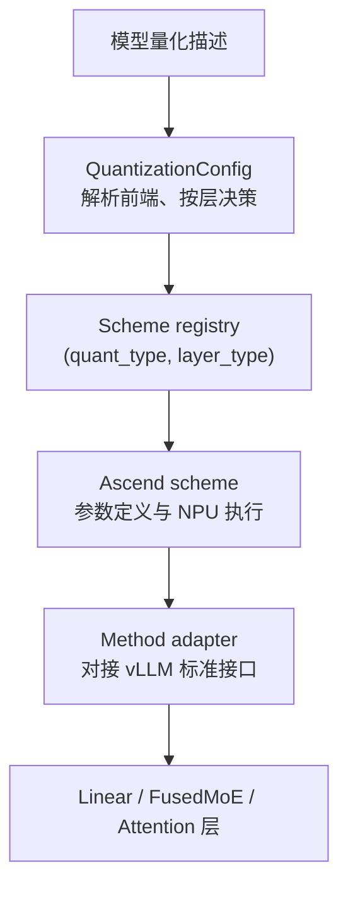

# vLLM-Ascend 量化机制总结与源码走读指导

本文以“一层量化 Linear 从配置识别到 NPU 算子执行”为主线，解释 vLLM-Ascend 的量化机制，并给出可实际照着断点、查字段、对张量的源码走读路线。

先记住整条主链：

```text
模型目录中的量化描述
  -> 识别量化前端（ascend / compressed-tensors / fp8）
  -> 创建 QuantizationConfig
  -> 建模时按 layer 类型和 prefix 选择量化 scheme
  -> adapter 按 vLLM 标准接口创建 Parameter
  -> checkpoint loader 把量化权重、scale、offset 装入 Parameter
  -> process_weights_after_loading() 做转置、展平、格式转换和派生参数计算
  -> forward 时 adapter.apply()
  -> scheme.apply() 动态或静态量化激活
  -> torch_npu 量化算子执行矩阵乘、MoE 或 KV Cache 读写
  -> 输出恢复为模型计算 dtype，进入下一层
```

建议先顺序阅读第 1～9 章，再按第 10 章选择一个具体量化类型做实战。本文相对路径分别以 `vllm/` 和 `vllm-ascend/` 仓库根目录为基准。

## 1. 一句话理解这里的量化

vLLM-Ascend 的量化不是在服务启动时把一个浮点模型临时压成低精度模型。常见路径是：

1. 模型已经由 ModelSlim、LLM-Compressor 等工具离线量化。
2. checkpoint 中保存低精度权重及 scale、offset 等量化参数。
3. vLLM-Ascend 读取量化描述，为每一层选择匹配的执行方案。
4. forward 时按方案量化激活，并调用 Ascend NPU 的量化算子直接消费低精度权重。

因此要始终区分三件事：

| 对象 | 何时量化 | 常见粒度 | 主要目的 |
|---|---|---|---|
| Weight | 通常离线完成 | per-channel / per-group | 减少模型显存和带宽，使用低精度矩阵乘 |
| Activation | forward 时静态或动态量化 | per-tensor / per-token / per-group | 让计算进入 W8A8、W4A8、MXFP 等低精度路径 |
| KV Cache | attention 执行时写入低精度缓存 | per-head / per-channel 等 | 减少长上下文 KV Cache 显存和搬运量 |

`W8A8` 表示 8 bit 权重、8 bit 激活；`W4A16` 表示 4 bit 权重、16 bit 激活。它只描述主要数据宽度，不足以完整描述量化：还必须继续确认数据类型、对称/非对称、静态/动态以及 scale 粒度。

## 2. 静态量化与动态量化

以仓库中最容易对照的两种 Linear 为例。

### 2.1 W8A8 静态量化

`AscendW8A8LinearMethod` 使用：

- int8 权重；
- 静态 per-tensor 激活 scale/offset；
- per-channel 权重 scale/offset；
- 每输出通道的反量化 scale 和 quant bias。

forward 的核心过程是：

```text
浮点 x
  -> torch.ops.vllm.quantize(x, input_scale, reciprocal, input_offset)
  -> int8 x_q
  -> torch_npu.npu_quant_matmul(x_q, weight, deq_scale, bias)
  -> fp16 / bf16 output
```

输入 scale 是 checkpoint 给定的固定参数。同一层不同请求、不同 token 使用同一套输入量化参数。

### 2.2 W8A8 动态量化

`AscendW8A8DynamicLinearMethod` 使用：

- int8 权重；
- forward 时根据当前输入计算 per-token scale；
- per-channel 权重 scale。

核心过程是：

```text
浮点 x
  -> torch_npu.npu_dynamic_quant(x)
  -> int8 x_q + pertoken_scale
  -> torch_npu.npu_quant_matmul(
       x_q, weight, weight_scale,
       pertoken_scale=pertoken_scale)
  -> 与 x 相同 dtype 的 output
```

动态量化省去了固定 `input_scale`，能适应各 token 的数值范围，但每次 forward 都要计算量化 scale。

## 3. 四层架构：不要把 Config、Scheme 和 Method 混在一起



四层职责分别是：

| 层次 | 代表对象 | 回答的问题 |
|---|---|---|
| 配置前端 | `AscendModelSlimConfig`、`AscendCompressedTensorsConfig`、`AscendFp8Config` | 模型使用哪种量化描述格式？某个 prefix 应量化吗？ |
| Scheme 注册表 | `_SCHEME_REGISTRY` | 某个 `quant_type + layer_type` 对应哪个实现类？ |
| 量化 Scheme | `AscendW8A8LinearMethod` 等 | 需要哪些参数？权重加载后怎么整理？forward 调哪个 NPU 算子？ |
| vLLM Adapter | `AscendLinearMethod`、`AscendFusedMoEMethod`、`AscendKVCacheMethod` | 如何满足 vLLM 的 `create_weights/process/apply` 协议？ |

这里有两级注册，名字相似但作用不同：

```text
@register_quantization_config("ascend")
  注册“模型级配置前端”

@register_scheme("W8A8_DYNAMIC", "linear")
  注册“某类层的具体执行方案”
```

## 4. 启动阶段：量化类型如何被识别

### 4.1 平台先注册 Ascend 量化前端

`NPUPlatform.pre_register_and_update()` 会导入三个配置类，导入动作触发装饰器注册：

| CLI / config 中的方法名 | Ascend 配置类 | 量化描述来源 |
|---|---|---|
| `ascend` | `AscendModelSlimConfig` | `quant_model_description.json` |
| `compressed-tensors` | `AscendCompressedTensorsConfig` | `config.json.quantization_config` |
| `fp8` / `deepseek_v4_fp8` | `AscendFp8Config` | `config.json.quantization_config` |

入口文件：

- `vllm_ascend/platform.py::NPUPlatform.pre_register_and_update()`
- `vllm_ascend/quantization/modelslim_config.py`
- `vllm_ascend/quantization/compressed_tensors_config.py`
- `vllm_ascend/quantization/fp8_config.py`

### 4.2 用户未指定时自动检测

`NPUPlatform.check_and_update_config()` 调用 `maybe_auto_detect_quantization()`：

```text
先找 quant_model_description.json
  -> 找到：ascend
否则读 config.json.quantization_config.quant_method
  -> compressed-tensors：compressed-tensors
  -> fp8：fp8
否则：按浮点模型处理
```

如果用户显式传入 `--quantization`，用户选择优先；自动检测结果不一致时只告警。若自动检测发生在 `VllmConfig.__post_init__` 之后，代码会重新创建 `vllm_config.quant_config`，否则后续各层拿不到量化配置。

对应源码：

- `vllm_ascend/quantization/utils.py::detect_quantization_method()`
- `vllm_ascend/quantization/utils.py::maybe_auto_detect_quantization()`
- `vllm_ascend/platform.py::NPUPlatform.check_and_update_config()`

## 5. 建模阶段：每一层如何选中具体 Scheme

ModelSlim 是信息最完整的一条路径，可用它建立主模型。

### 5.1 先把层名对齐

checkpoint、Hugging Face 模型和 vLLM 优化后的模块名可能不同，例如：

- 多个投影被融合为一个 packed module；
- `mlp` 被实现为 `block_sparse_moe`；
- HF prefix 被 `WeightsMapper` 转成 vLLM prefix；
- `q_proj/k_proj/v_proj` 被融合为 `qkv_proj`。

`AscendModelSlimConfig` 会先用 model-specific mapping 修正 prefix。对 fused layer，还会逐个检查各 shard 的量化类型；同一融合层的 shard 精度不一致会直接报错，因为一个 fused Parameter 不能安全套用两种 Scheme。

### 5.2 再按层类型分派

`AscendModelSlimConfig.get_quant_method()` 大致执行：

```text
LinearBase
  -> FLOAT ? AscendUnquantizedLinearMethod
  -> 读取 <prefix>.weight 对应的 quant_type
  -> get_scheme_class(quant_type, "linear")
  -> AscendLinearMethod(scheme)

FusedMoE
  -> FLOAT ? AscendUnquantizedFusedMoEMethod
  -> get_scheme_class(quant_type, "moe")
  -> AscendFusedMoEMethod(scheme)

AttentionLayerBase
  -> FA / indexer / C8 KV 命中
  -> AscendKVCacheMethod(attention_scheme)

VocabParallelEmbedding
  -> 复用 linear scheme
  -> AscendEmbeddingMethod(scheme)
```

关键源码：

- `modelslim_config.py::get_quant_method()`
- `modelslim_config.py::get_quant_type_for_layer()`
- `modelslim_config.py::create_scheme_for_layer()`
- `methods/registry.py::get_scheme_class()`
- `methods/__init__.py`，其导入负责让所有装饰器完成注册

## 6. 一层量化权重的完整生命周期

量化层最值得跟的不是单个算子，而是下面四个阶段。

### 6.1 阶段 A：选择 Method

以 Ascend Linear 为例：

```text
AscendLinearBase.__init__
  -> quant_config.get_quant_method(self, prefix)
  -> AscendLinearMethod(concrete_scheme)
  -> self.quant_method = adapter
```

入口：`vllm_ascend/ops/linear.py`。

### 6.2 阶段 B：创建 Parameter 壳

建模时还没有加载 checkpoint。`AscendLinearMethod.create_weights()` 向 Scheme 询问需要哪些张量：

```text
scheme.get_weight()
scheme.get_pertensor_param()
scheme.get_perchannel_param()
scheme.get_pergroup_param()
  -> 注册 weight / input_scale / weight_scale / offset / bias ...
  -> 附加 input_dim、output_dim、packed_factor、weight_loader 等属性
```

这些属性决定 TP 切分、packed 权重解释和 checkpoint loader 如何写入，而不只是类型标注。

入口：`vllm_ascend/quantization/method_adapters.py::AscendLinearMethod.create_weights()`。

### 6.3 阶段 C：加载 checkpoint 并做后处理

默认 loader 先按参数名和 `weight_loader` 把 checkpoint 张量写入 Parameter，随后统一调用：

```text
process_weights_after_loading(model, ...)
  -> module.quant_method.process_weights_after_loading(module)
  -> adapter 转发给 scheme
```

后处理经常执行：

- 把 `[out, in]` 权重转置为 NPU matmul 需要的布局；
- contiguous 和 FRACTAL_NZ 格式转换；
- flatten per-channel scale/offset；
- 计算 reciprocal、组合 dequant scale 等派生量；
- 对大权重分块；
- 删除只在加载期存在的原始 Parameter。

所以“checkpoint 中的张量形状正确”不等于“运行时张量形状正确”。排查问题必须同时记录加载前后两份状态。

上游入口：

- `vllm/model_executor/model_loader/utils.py::process_weights_after_loading()`
- `vllm/model_executor/model_loader/default_loader.py`

### 6.4 阶段 D：forward 执行

```text
Linear.forward
  -> self.quant_method.apply(layer, x, bias)
  -> AscendLinearMethod.apply()
  -> concrete_scheme.apply()
  -> torch.ops.vllm.quantize / torch_npu.npu_dynamic_quant
  -> torch_npu.npu_quant_matmul
```

Adapter 还会根据 RowParallel、DSA CP、MLP TP 等场景决定 `tp_rank`，具体 Scheme 再据此处理 bias 或通信路径。

## 7. W8A8 静态 Linear 逐行走读

推荐把 `methods/w8a8_static.py` 作为第一份 Scheme 实现阅读。

### 7.1 参数创建

`get_weight()` 创建：

```text
weight: [output_size, input_size], int8
```

`get_pertensor_param()` 创建：

```text
input_scale:  [1], model dtype
input_offset: [1], int8
```

`get_perchannel_param()` 创建：

```text
quant_bias:    [output_size], int32
deq_scale:     [output_size], fp32 或 int64
weight_scale:  [output_size, 1], model dtype
weight_offset: [output_size, 1], model dtype
```

### 7.2 权重加载后

`process_weights_after_loading()`：

1. 将单值 `input_scale/input_offset` 扩展到输入维度。
2. 生成 `input_scale` 的 reciprocal，供融合量化 op 使用。
3. 将权重转置、连续化，并按条件转换成 NZ 格式。
4. 展平 weight scale/offset。
5. 对 compressed-tensors 路径按输入 scale 与权重 scale 组合 `deq_scale`。

### 7.3 forward

若输入还不是 int8：

```text
x = torch.ops.vllm.quantize(
    x,
    layer.aclnn_input_scale,
    layer.aclnn_input_scale_reciprocal,
    layer.aclnn_input_offset,
)
```

随后：

```text
output = torch_npu.npu_quant_matmul(
    x,
    layer.weight,
    layer.deq_scale,
    bias=quant_bias,
    output_dtype=layer.params_dtype,
)
```

走读时重点核对：输入是否已被上游融合路径提前量化、weight 是否已转置/NZ 化、`deq_scale` 的 dtype，以及 TP 非 0 rank 是否应携带 bias。

## 8. 其他主要分支如何理解

仓库当前注册的主要组合可用下面的表定位。这里列的是 Scheme 注册名，不代表所有设备、模型结构和算子版本都支持任意组合。

| quant type | Linear | MoE | Attention / KV |
|---|---:|---:|---:|
| `W8A8` | `w8a8_static.py` | — | — |
| `W8A8_DYNAMIC` | `w8a8_dynamic.py` | `w8a8_dynamic.py` | — |
| `W8A8FP8_DYNAMIC` | `w8a8fp8_dynamic.py` | 同文件 | — |
| `W8A8_MXFP8` | `w8a8_mxfp8.py` | 同文件 | — |
| `W8A8_MIX` | `w8a8_pdmix.py` | 同文件 | — |
| `W8A16` | `w8a16.py` | — | — |
| `W4A8_DYNAMIC` | `w4a8.py` | 同文件 | — |
| `W4A8_MXFP` | `w4a8_mxfp4.py` | 同文件 | — |
| `W4A16` | — | `w4a16.py` | — |
| `W4A4_DYNAMIC` | `w4a4_laos_dynamic.py` | — | — |
| `W4A4_FLATQUANT_DYNAMIC` | `w4a4_flatquant.py` | — | — |
| `W4A4_MXFP4` | `w4a4_mxfp4.py` | 同文件 | — |
| `W4A4_MXFP4_FLATQUANT` | `w4a4_mxfp4_flatquant.py` | — | — |
| `FP8` | `fp8.py` 的 `ds_linear` | `fp8.py` 的 `w4a8_moe` | — |
| `FAKQuant` | — | — | `kv_c8.py` |
| `INT8_DYNAMIC` | — | — | `kv_c8.py` 的 indexer |

阅读这些文件时，统一用四问法：

1. `get_weight()` 创建的低精度 dtype 和 packed shape 是什么？
2. scale 是 per-tensor、per-channel、per-token 还是 per-group？
3. `process_weights_after_loading()` 是否改变布局或产生新参数？
4. `apply()` 最终调用哪个 NPU op，op 的 scale/offset 参数各来自哪里？

### 8.1 4 bit 权重

4 bit 权重常以 packed 形式存储，一个物理元素可能承载两个逻辑值。走读时必须同时记录：

- Parameter 的物理 shape；
- `_packed_dim` 和 `_packed_factor`；
- group size；
- scale/offset 的逻辑 shape；
- 后处理是否重排权重。

只看 `weight.numel()` 很容易把压缩率、TP shard 或输出维度判断错。

### 8.2 MXFP

MXFP4/MXFP8 除低精度数据本身外，还使用 block scale。设备是否具备对应 dtype 由 `vllm_ascend/device/mxfp_compat.py` 检查。看到 MXFP 初始化失败，应先确认 torch_npu/设备代际和 scale dtype 能力，再查层级配置。

### 8.3 MoE

MoE 不是把 Linear Scheme 简单循环 N 次。`AscendFusedMoEMethod` 会创建带 expert 维度的 `w13/w2` 权重和动态量化参数，执行时还要处理：

- top-k expert 选择；
- expert map 与逻辑/物理 expert 映射；
- EP、TP、MC2 等通信；
- grouped matmul 与 SwiGLU 融合；
- EPLB 造成的 expert 布局变化。

主入口：

- `vllm_ascend/ops/fused_moe/fused_moe.py`
- `vllm_ascend/quantization/method_adapters.py::AscendFusedMoEMethod`
- 各 `methods/*.py` 中的 `Ascend*FusedMoEMethod`

## 9. KV Cache 量化是另一条执行链

KV Cache 量化仍由 `QuantizationConfig.get_quant_method()` 选择和创建参数，但数据真正量化、写缓存和反量化读取通常发生在 attention backend，而不是 Linear 的 `npu_quant_matmul` 路径。

### 9.1 FA / MLA K Cache 量化

`FAKQuant` Scheme 会创建 `fa_q/fa_k/fa_v` 的 scale 和 offset，并在加载后派生：

- `fak_descale`；
- `fak_descale_reciprocal`；
- `fak_offset`；
- MLA 使用的 `quant_kscale`。

不同设备代际和 PD 角色对是否启用 FA quant 有额外限制，入口是：

- `modelslim_config.py::is_fa_quant_layer()`
- `modelslim_config.py::enabling_fa_quant()`
- `quantization/utils.py::enable_fa_quant()`

### 9.2 Dense Attention 的 C8 KV Cache

`AscendC8KVCacheAttentionMethod.create_weights()`：

1. 创建 K/V cache scale 和 offset。
2. 必要时把 `kv_cache_torch_dtype` 设为 int8。
3. 把 attention impl 升级为 `AscendC8AttentionBackendImpl`。

其 `apply()` 故意抛异常，因为 C8 的实际 forward 已由 attention backend 接管。这是排查时的重要边界：如果断点只打在 `AscendKVCacheMethod.apply()`，可能误以为量化没有执行。

继续阅读：

- `vllm_ascend/quantization/methods/kv_c8.py`
- `vllm_ascend/attention/attention_v1.py::AscendC8AttentionBackendImpl`
- `vllm_ascend/core/kv_cache_interface.py`
- `vllm_ascend/device/device_op.py` 中 KV quant/scatter 相关接口

### 9.3 KV Pool 与 KV 量化的交界

KV Pool 负责按字节搬运本地 KV block；KV 量化决定 block 的 dtype、shape、scale 附属数据和真实字节数。两者联调时必须确保：

- producer 与 consumer 使用相同 KV 量化配置；
- 注册给 Connector 的 tensor layout 与 attention backend 一致；
- 量化 scale/offset 已加载；
- 每 block 字节数按实际 tensor 计算，而不是按原始 bf16 推算；
- layerwise Connector 对量化层使用正确的切分和拷贝逻辑。

KV Pool 的控制流和数据流可继续参阅 `KV_POOL_SOURCE_READING_GUIDE.md`。

## 10. 推荐的源码走读路线

不要一开始遍历全部量化文件。选一个真实模型的一层，例如 `model.layers.0.self_attn.q_proj`，沿下面路线走。

### 路线 A：配置与注册

1. `vllm_ascend/platform.py::pre_register_and_update()`
2. `vllm_ascend/quantization/utils.py::maybe_auto_detect_quantization()`
3. 对应 Config 的 `maybe_update_config()/from_config()`
4. `methods/__init__.py`
5. `methods/registry.py`

完成标准：能说清 `vllm_config.model_config.quantization` 与 `vllm_config.quant_config` 各是什么。

### 路线 B：按层选择

1. 在目标层构造函数找到 `quant_config.get_quant_method()`。
2. 记录传入的 `layer.__class__` 和完整 `prefix`。
3. 进入 Config 的 `get_quant_method()`。
4. 记录量化描述中命中的 key/value。
5. 进入 `create_scheme_for_layer()` 和 `get_scheme_class()`。
6. 确认返回的 Adapter 与具体 Scheme 类名。

完成标准：能解释为什么目标层量化、为什么相邻层可能保持 FLOAT。

### 路线 C：参数创建与权重加载

1. 进入 Adapter 的 `create_weights()`。
2. 分别检查 `get_weight/get_pertensor/get_perchannel/get_pergroup`。
3. 记录所有 Parameter 的 shape、dtype 和 loader 属性。
4. 在 checkpoint loader 中确认每个参数实际命中的权重名。
5. 在 `process_weights_after_loading()` 前后各记录一次参数表。

完成标准：能把 checkpoint 的每个量化参数对应到运行时 layer 属性。

### 路线 D：单次 forward

1. 从模型层的 `forward()` 进入 Linear/MoE/Attention。
2. 进入 Adapter 的 `apply()`。
3. 进入具体 Scheme 的 `apply()`。
4. 记录激活量化前后的 dtype、shape 和 scale shape。
5. 记录 NPU op 名、weight layout、输出 dtype。
6. 检查是否还有融合 pass 或通信路径提前/延后了量化。

完成标准：能画出目标层一次 forward 的张量变化图。

## 11. 走读时维护两张表

### 11.1 层级决策表

| 字段 | 示例 |
|---|---|
| prefix | `model.layers.0.self_attn.q_proj` |
| layer class | `ColumnParallelLinear` |
| config frontend | `AscendModelSlimConfig` |
| description key | `<prefix>.weight` |
| quant type | `W8A8_DYNAMIC` |
| scheme | `AscendW8A8DynamicLinearMethod` |
| adapter | `AscendLinearMethod` |
| skipped | `False` |

### 11.2 张量生命周期表

| 时点 | tensor | shape | dtype/layout | scale 来源 |
|---|---|---|---|---|
| create | `weight` | `[out, in]` | int8 / ND | checkpoint |
| loaded | `weight_scale` | `[out, 1]` | bf16 | checkpoint |
| processed | `weight` | `[in, out]` | int8 / NZ 或 ND | — |
| forward | `x_q` | 与 x 对应 | int8 | 静态 input scale 或动态 per-token scale |
| output | `y` | `[..., out]` | fp16/bf16 | NPU quant matmul 反量化 |

没有这两张表，prefix 映射、TP 切分、packed shape 和后处理很容易在脑中串线。

## 12. 建议断点与日志字段

优先断点：

```text
NPUPlatform.check_and_update_config
maybe_auto_detect_quantization
AscendModelSlimConfig.maybe_update_config
AscendModelSlimConfig.get_quant_method
create_scheme_for_layer
AscendLinearMethod.create_weights
<目标 Scheme>.process_weights_after_loading
<目标 Scheme>.apply
```

每个断点至少记录：

```text
model quantization method
quant_config concrete class
layer class + prefix
quant type + scheme class + adapter class
parameter name + shape + dtype + device
weight layout / storage format
input dtype + quantized input dtype
scale / offset shape and dtype
NPU op name + output dtype
TP/EP rank and device generation
```

打印张量数值时只取少量统计：`min/max/absmax/mean/isfinite`。完整打印大权重不仅慢，也很难发现布局或 scale 粒度错误。

## 13. 常见故障按阶段定位

| 现象 | 优先检查 |
|---|---|
| 模型被当成浮点加载 | 自动检测文件是否存在；`model_config.quantization`；`vllm_config.quant_config` 是否重建 |
| 报找不到量化描述 | `quant_model_description.json` 路径；是否误传 `--quantization ascend` |
| 某层没有量化 | prefix mapper；`FLOAT` 标记；ignore/target 规则；layer class 是否命中 |
| fused QKV/MLP 报类型不一致 | packed mapping 下各 shard 的 quant type 是否一致 |
| 权重 shape 不匹配 | TP loader 属性；packed factor；加载前后转置；MoE expert 维度 |
| NPU op dtype 报错 | 激活量化类型、scale dtype、output dtype、设备代际能力 |
| 能运行但精度异常 | scale/offset 方向；静态/动态配置错配；bias；权重布局；重复量化 |
| 首次运行正常、图模式异常 | 动态 shape；后处理生成的临时属性；fusion pass 是否替换量化节点 |
| KV Cache 量化未生效 | attention impl 类型；量化层列表；PD role；cache dtype 与 scale 是否一致 |
| MoE 结果错误 | logical/physical expert 映射；expert map；scale 的 expert 维；EP/TP 通信路径 |

一个高频误区是把 `weight_scale`、`input_scale` 和算子接收的 `deq_scale` 当成同一概念。它们可能在 checkpoint 中分别存在，也可能在后处理中组合或转换 dtype。应以具体 Scheme 的 `process_weights_after_loading()` 和 `apply()` 为准。

## 14. 测试如何与实现对应

先运行不依赖真实 NPU 大模型的单元测试，再做单卡端到端验证。

配置与注册：

```text
tests/ut/quantization/test_quant_parser.py
tests/ut/quantization/test_modelslim_config.py
tests/ut/quantization/test_compressed_tensors_config.py
tests/ut/quantization/test_method_adapters.py
tests/ut/quantization/methods/test_registry.py
```

具体 Scheme：

```text
tests/ut/quantization/methods/a2/test_w8a8_static.py
tests/ut/quantization/methods/a2/test_w8a8_dynamic.py
tests/ut/quantization/methods/a2/test_w4a8.py
tests/ut/quantization/methods/test_w8a8_mxfp8.py
tests/ut/quantization/methods/test_w4a4_mxfp4.py
tests/ut/quantization/methods/test_kv_c8.py
```

端到端与融合：

```text
tests/e2e/pull_request/one_card/test_qwen3_8b_w8a8.py
tests/e2e/pull_request/one_card/compile/test_norm_quant_fusion.py
tests/e2e/nightly/single_node/ops/singlecard_ops/test_grouped_matmul_swiglu_quant.py
```

验证顺序建议：

1. Config 能否为指定 prefix 选中正确 Scheme。
2. `create_weights()` 的 shape/dtype 是否符合 checkpoint。
3. 后处理后的布局和派生 scale 是否正确。
4. 单算子结果是否与反量化浮点参考对齐。
5. 单层结果是否对齐。
6. 小模型 greedy 输出是否对齐。
7. 再验证 TP/EP、图模式、长序列和并发性能。

## 15. 最终应能复述的机制

完成走读后，应能不看源码说明：

> vLLM-Ascend 先从模型文件或用户参数确定量化配置前端，再由 QuantizationConfig 根据层类型、prefix 和量化描述选择具体 Scheme。Adapter 把 Scheme 接入 vLLM 的建模、权重加载和 forward 生命周期。Scheme 定义低精度权重及 scale/offset 参数，在权重加载后完成布局与派生参数处理，并在 forward 中量化激活、调用 NPU 量化算子。Linear、MoE 和 KV Cache 共用配置选择框架，但最终执行路径分别落到量化矩阵乘、融合 MoE 和 attention backend。

如果这段话中的每个对象都能对应到一个具体类、方法、Parameter 和 NPU op，就已经掌握了 vLLM-Ascend 量化机制的主干。
